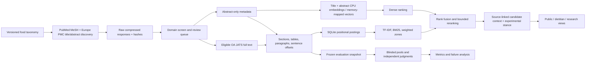

# Architecture and scientific boundaries

All bulk state lives under the configurable E: root. Source code and lightweight deliverables live in this project. The local HTTP server binds only to loopback; external publication and authentication are not implemented or implied. Same-origin JSON writes and Host checks reduce cross-origin access to private sessions. This is a single-user local application, not a production multi-tenant service.

## Data contracts
`contracts.py` separates relevance, passage stance, context compatibility and source spans. `web/contracts.d.ts` documents the matching frontend/API interfaces; `web/app.ts` compiles to checked-in JavaScript with TypeScript 5.9.3 and noEmitOnError. Strict mode is not yet enabled. Unknown context is preserved. Experimental NLI scores are raw uncalibrated outputs, not probabilities of truth. The model's neutral label is only a candidate “insufficient to establish” passage relation, not a literature-wide conclusion.

## Reproducibility
Raw metadata/XML are SHA-256-addressed gzip blobs. Requests retain URL, time and response hash. Normalized passages identify parents, sections, paragraph offsets and sentence boundaries. Index configuration records corpus fingerprint and weights. Model IDs/revisions are pinned. Benchmark snapshots remove private sessions and keep judgments out of the article index. User notes and queries are not written to HTTP access logs.

## Current limitations to retain visibly
Regex-derived source mentions can come from background, another study, or another arm. Context matching cannot be established from a shared keyword. The local NLI model may truncate long inputs and is trained outside the food benchmark. The embedding model also truncates inputs; manifests report how often. Paper identity deduplication does not resolve shared cohorts or primary studies within reviews. Retraction/correction metadata are preserved but coverage is incomplete. These are scientific limitations, not UI states to hide.

## Scaling decisions
Explicit SQL postings are intentionally inspectable for the course. Positional JSON and duplicated context cost storage; pilot and expanded runs quantify it. Dense vectors are memory mapped and scanned in bounded batches. At larger measured scale, compact postings and approximate nearest-neighbor retrieval should be evaluated before growing without bound. Full-text expansion remains subject to screening quality, API politeness, RAM and disk reserves.
